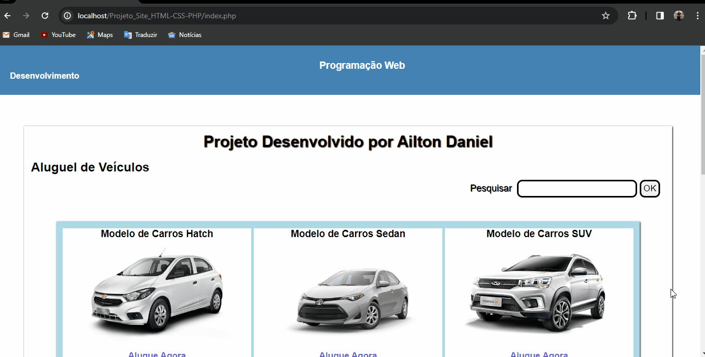

# LocaCar

LocaCar é um site para locação de automóveis. O site permite aos usuários visualizar modelos disponíveis para aluguel, facilitando a seleção e reserva de veículos conforme suas necessidades.

## Recursos Principais

- Visualização de diferentes modelos de carros disponíveis para locação.
- Sistema de reserva simpples para os usuários selecionarem datas de retirada do veículo.
- Interface simplificada e amigável para facilitar a navegação e utilização do site.

## Tecnologias Utilizadas

Este projeto utiliza as seguintes tecnologias:

HTML: Utilizado para a estruturação do conteúdo do site.
CSS: Utilizado para estilização e design da interface do usuário.
PHP: Utilizado para adicionar funcionalidades dinâmicas ao site e processar formulários.

## Instalação

1. Clone este repositório: `https://github.com/https-ailton-dev/ProjetoWeb-Aluguel-Veiculos.git` ou `git@github.com:https-ailton-dev/ProjetoWeb-Aluguel-Veiculos.git`
2. Navegue até o diretório do projeto.
3. Mova o diretório do projeto para dentro do servidor local de sua preferencia. (Ex: `C:\xampp\htdocs\Nome_do_Diretório`)

## Como Usar

1. Execute o código dentro do servidor local.
2. Navegue pelas diferentes páginas dedicadas de cada modelo.
3. Explore cada funcionalidade oferecida.

# Desmontração
1. Index

2. Modelo Hatch

3. Modelo Sedan

4. Modelo SUV

5. Pesquisa

6. Reserva
